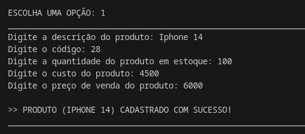
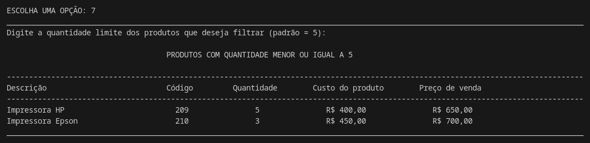

# Projeto de Gerenciamento de Estoque

Este projeto é um sistema simples de gerenciamento de estoque desenvolvido em Python. Ele permite o cadastro, consulta, atualização e remoção de produtos, além de realizar cálculos sobre o estoque, como total em estoque e lucro presumido.

## Linguagens e Tecnologias utilizadas
- Python
- Visual Studio Code

## Como executar o código ?

Antes de executar o código, certifique-se de ter instalado o Python (versão 3.x ou superior).

Windows:
```
python --version
```

Linux e MacOS:

```
python3 --version
```

1 . Abra o terminal e execute o seguinte comando para clonar o repositório:

 ```
 git clone https://github.com/gabiihdev/Projeto_Controle_Estoque.git
 ```

2 . Acesse o diretório do projeto:

```
cd Projeto_Controle_Estoque
```

3 . Execute o código:

```
python3 controle_estoque.py
```

4 . Após a execução, a seguinte tela será exibida:


## Funcionalidades

### 1 . Cadastrar Produtos

-> Adiciona um novo produto ao estoque, verificando se já existe um produto com o mesmo nome ou código.



Caso o usuário tente cadastrar um produto que já existe no estoque, a seguinte mensagem de erro será exibida:

```
>> ERRO: O PRODUTO "NOME DO PRODUTO" JÁ ESTÁ CADASTRADO NO ESTOQUE.
```

Caso o usuário tente cadastrar um produto com um código que já está sendo utilizado, a seguinte mensagem de erro será exibida:

```
>> ERRO: EXISTE UM PRODUTO COM O CÓDIGO "CÓDIGO DO PRODUTO" NO ESTOQUE.
```

Caso o usuário não digite um número nos campos: código, quantidade, custo e preço, a seguinte mensagem de erro será exibida:

```
>> ERRO: DIGITE UM NÚMERO VÁLIDO.
```

### 2 . Listar Produtos: 

-> Exibe todos os produtos cadastrados no estoque.


### 3 . Ordenar Produtos por Quantidade

-> Lista os produtos em ordem crescente ou decrescente conforme a quantidade disponível.

Quantidade ordem crescente:


Quantidade em ordem decrescente:


Caso o usuário digite algo diferente de "crescente" ou "decrescente", a seguinte mensagem de erro será exibida:

```
>> ORDEM INVÁLIDA. ESCOLHA ENTRE "CRESCENTE" OU "DECRESCENTE".
```

### 4 . Buscar Produto

-> Permite localizar um produto pelo código ou descrição.

Busca por código do produto:


Busca por descrição do produto:


Caso o produto não exista no estoque, a seguinte mensagem será exibida:

```
>> PRODUTO NÃO ENCONTRADO.
```

### 5 . Remover Produto

-> Exclui um produto do estoque, desde que ele esteja cadastrado.


Caso o usuário não digite um número inteiro, a seguinte mensagem será exibida:

```
ERRO: DIGITE UM NÚMERO INTEIRO.
```

Caso o produto não exista no estoque, a seguinte mensagem será exibida:

```
>> PRODUTO NÃO ENCONTRADO.
```

### 6 . Consultar Produtos Esgotados

-> Exibe os produtos que estão com quantidade zero no estoque.


Caso não tenha produtos esgotados, a seguinte mensagem será exibida:

```
>> NENHUM PRODUTO ESGOTADO.
```

### 7 . Filtrar Produtos com Baixa Quantidade

-> Mostra os produtos que possuem quantidade abaixo de um limite definido pelo usuário (padrão: 5 unidades).


Caso o usuário não digite um número inteiro, a seguinte mensagem será exibida:

```
>> ERRO: DIGITE UM NÚMERO INTEIRO.
```

Caso o usuário não especifique uma quantidade limite, o valor padrão será 5:



### 8 . Atualizar Quantidade do Produto

->  Permite adicionar ou retirar unidades do estoque de um produto específico.

Entrada (aumento):


Saída (redução):


Caso o código não seja encontrado, a seguinte mensagem será exibida:

```
>> PRODUTO NÃO ENCONTRADO.
```

Caso o usuário não digite 1 ou 2, a seguinte mensagem será exibida:

```
>> OPÇÃO INVÁLIDA. DIGITE 1 OU 2.
```

Caso a quantidade não seja um número inteiro, a seguinte mensagem será exibida:

```
>> ERRO: DIGITE UM NÚMERO INTEIRO.
```

### 9 . Atualizar Preço do Produto

-> Modifica o preço de um produto cadastrado.


Caso o usuário não digite um número, a seguinte mensagem será exibida:

```
>> DIGITE UM NÚMERO VÁLIDO.
```

Caso o produto não seja encontrado, a seguinte mensagem será exibida:

```
>> PRODUTO NÃO ENCONTRADO.
```

### 10 . Consultar Valor Total do Estoque

-> Calcula e exibe o valor total de todos os produtos disponíveis no estoque.


### 11 . Consultar Lucro Presumido do Estoque

-> Estima o lucro potencial com base na diferença entre custo e preço de venda dos produtos.


### 12 . Gerar Relatório Geral do Estoque

-> Cria um relatório detalhado com todas as informações do estoque.


### 0 . Sair do Programa

-> Finaliza a execução do sistema.


## Contribuições

Sinta-se à vontade para contribuir com melhorias para este projeto.
